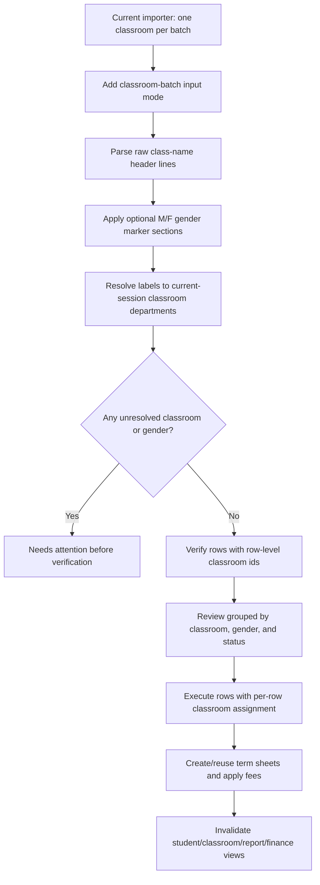

# Plan: Batch Classroom Student Import Support

## Type

Feature

## Status

In Progress

## Created Date

2026-06-19

## Last Updated

2026-06-19

## Goal Or Problem

Allow operators to import students for multiple classrooms in one pasted batch while preserving the current student import safeguards: tenant-scoped verification, match review, gender inference, explicit row decisions, idempotent term-sheet creation, and fee-history application.

## Current Context

- The existing student import workflow supports one selected `classroomDepartmentId` for the entire batch.
- The dashboard start screen lives in `apps/dashboard/src/components/modals/student-import/index.tsx` and parses input through `apps/dashboard/src/components/modals/student-import/parser.ts`.
- Review and execution live in `apps/dashboard/src/components/modals/student-import/import-activities.tsx`.
- `trpc.students.verifyStudentImport` and `trpc.students.executeStudentImport` currently accept one `classroomDepartmentId` plus rows.
- Import execution already creates new students, keeps/updates matched students, creates current session/term forms idempotently, detects conflicting current-term classrooms, and applies fee histories.
- `brain/features/student-import.md`, `brain/api/contracts.md`, `brain/api/endpoints.md`, and `brain/database/relationships.md` document the current single-classroom import behavior.

## Proposed Approach

Extend the importer from a single target classroom per batch to row-scoped classroom assignment while keeping the existing single-classroom path as the default. Add a classroom-batch mode on the start screen that treats raw class-name lines as section headers, assigns following student-name lines to that classroom until the next class-name header, supports raw batch-gender marker lines inside each classroom section, maps class-name headers to current-session `ClassRoomDepartment` records, surfaces unresolved/ambiguous classroom assignments before verification, and sends row-level `classroomDepartmentId` values through verification and execution.

The backend should support row-level classrooms without weakening tenant/session checks. `verifyStudentImport` should validate all referenced classroom departments once, enrich match metadata against each row's target classroom, and classify missing classroom rows as `needsAttention`. `executeStudentImport` should create or reuse term sheets per row's target classroom and report row-level failures for conflicts.

## Visual Plan



## Implementation Steps

- Add a classroom import mode to the modal start screen:
  - `Single classroom` keeps the current required classroom select.
  - `Multiple classrooms` enables classroom label parsing and row-level classroom assignment.
- Extend `parseRawInput` or add a companion parser that returns `classroomDepartmentId`, `classroomLabel`, and `classroomResolutionStatus` per row.
- Support the raw class-name group input grammar:
  - a line matching a current-session classroom label starts a classroom section;
  - following non-empty lines are parsed as student rows for that classroom;
  - the classroom section remains active until another class-name line is found;
  - a line matching `M`, `Male`, `F`, or `Female` starts or changes the active batch-gender section inside the current classroom;
  - batch gender applies only to following student rows that do not have an explicit row-level gender;
  - explicit row-level gender such as `Student Name, M` or `Student Name, F` overrides the active batch-gender marker;
  - student rows keep the current name/gender parsing rules, including dot/comma/Arabic-comma delimiters and optional row gender;
  - rows before the first resolved class-name header are marked `needsAttention` for manual classroom assignment.
- Use this target input shape as the primary manual paste format:

  ```text
  JSS 1 - A
  M
  Aisha Musa
  John Doe
  F
  Maryam Bello

  JSS 1 - B
  Yusuf Ahmad, M
  Fatima Lawal, F
  ```

- Support separator variants for gender marker lines:

  ```text
  JSS 1 - A
  M | Male
  Aisha Musa
  John Doe

  F | Female
  Maryam Bello

  JSS 2 - B
  Yusuf Ahmad, M
  Fatima Lawal, F
  ```

- Build a classroom-label resolver from `classList.data` using normalized class/department labels such as `JSS 1 - A`, department name, class name, and known display labels. Require exact normalized matches for automatic header detection in v1; ambiguous matches should require manual selection.
- Surface unresolved or ambiguous classroom labels in the start screen and review screen with manual assignment controls.
- Surface active batch-gender sections in the parsed preview so operators can see which gender default applied to each row.
- Update `verifyStudentImportSchema` to accept either legacy batch-level `classroomDepartmentId` or row-level `classroomDepartmentId` values.
- Update `verifyStudentImport` to:
  - validate every referenced classroom against active tenant and session;
  - use each row's target classroom for `isCurrentClassroomMatch`;
  - return target classroom metadata and `needsAttention` when classroom resolution is missing.
- Update `executeStudentImportSchema` to accept row-level `classroomDepartmentId`, keeping the current batch-level field for backward compatibility during the UI transition.
- Update `executeStudentImport` to use the row target classroom for new student creation, keep/update term-sheet creation, fee-history application, and current-term conflict checks.
- Update review UI grouping and summaries so operators can scan by classroom and by row status without losing existing `Ready`, `Match Found`, and `Needs attention` buckets.
- Update cache invalidation to include the same student/classroom queries and note that report/finance views refresh by parameterized navigation.
- Update Brain docs after implementation to record the new multi-classroom input contract and API shapes.

## Affected Files Or Areas

- `apps/dashboard/src/components/modals/student-import/index.tsx`
- `apps/dashboard/src/components/modals/student-import/parser.ts`
- `apps/dashboard/src/components/modals/student-import/import-activities.tsx`
- `apps/api/src/db/queries/students.ts`
- `apps/api/src/trpc/routers/students.routes.ts`
- `brain/features/student-import.md`
- `brain/api/contracts.md`
- `brain/api/endpoints.md`
- `brain/database/relationships.md`

## Acceptance Criteria

- Operators can import a pasted batch containing students for more than one current-session classroom.
- Existing single-classroom import behavior remains available and unchanged for current users.
- Multi-classroom batches assign each row to a validated current-session classroom department before execution.
- Batch gender marker lines apply `Male` or `Female` to following student rows until another gender marker or class header changes context.
- Explicit row-level gender overrides the active batch-gender marker.
- Unresolved or ambiguous classroom labels are shown as attention items and cannot execute until resolved or unchecked.
- Verification and matching use the row's target classroom when computing current-classroom metadata.
- Execution creates new students and current term sheets in each row's target classroom.
- Existing matched students are kept/updated without duplicating student records.
- Current-term conflicts in a different classroom remain row-level failures with a clear reason.
- Fee histories are applied to newly created term sheets using the row target classroom.
- Completion summary includes classroom-aware counts or enough row metadata to identify where each row landed.

## Test Plan

- Run `bun --filter @school-clerk/api typecheck`.
- Run `bun --filter @school-clerk/dashboard typecheck`.
- Manually verify single-classroom import still works.
- Manually verify a batch with two raw class-name headers resolves rows into the correct classroom groups.
- Manually verify `M`, `Male`, `F`, `Female`, `M | Male`, and `F | Female` marker lines apply gender defaults to following rows.
- Manually verify row-level `, M` and `, F` override the active batch-gender marker.
- Manually verify student rows before the first class-name header are blocked until manually assigned.
- Manually verify unresolved classroom labels block execution until manually resolved.
- Manually verify exact/suspected matches show correct same-classroom and current-term badges per row target classroom.
- Manually verify execution creates term sheets in different classrooms and reports cross-classroom current-term conflicts per row.

## Risks / Edge Cases

- Classroom label matching can be ambiguous when departments share names across classes. Prefer explicit conflict UI over guessing.
- Gender marker detection can collide with a one-letter student name only in rare cases; only treat exact recognized gender-marker lines as markers.
- A broad API contract change could break the existing importer if backward compatibility is not preserved during rollout.
- Multi-classroom import increases the chance of cross-classroom current-term conflicts; keep those failures row-scoped.
- Fee-history application must remain classroom-specific so students do not receive fees for the wrong classroom.
- Very large multi-classroom batches may need chunked verification/execution later; first implementation should keep payloads compact and deterministic.

## Open Questions

- TODO: Should review grouping prioritize classroom first, status first, or offer both filters?
- TODO: Should execution be one mutation for the whole multi-classroom batch or one server-side transaction chunk per classroom?

## Linked Task

- Task Title: Batch Classroom Student Import Support
- Task File: brain/tasks/in-progress.md
