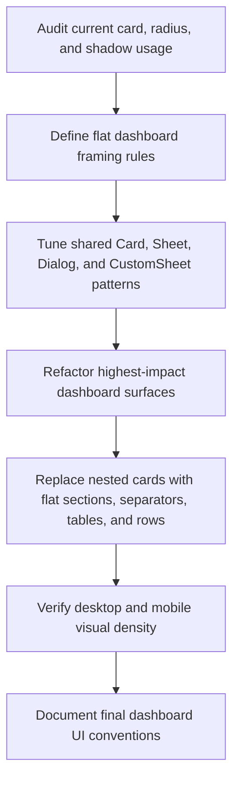

# Plan: Flat Minimal Dashboard UI Audit And Refactor

## Type
Feature

## Status
In Progress

## Created Date
2026-06-19

## Last Updated
2026-06-19

## Goal Or Problem
Dashboard pages, sheets, and modals currently feel over-framed because many surfaces are presented as cards, nested cards, rounded panels, or shadowed containers. The goal is to audit the dashboard UI and plan a staged refactor toward a flatter, cleaner, more minimal product interface while preserving readability, workflows, and accessibility.

## Current Context
- `apps/dashboard` is the authenticated product UI and should follow the Midday-inspired page, table, modal, sheet, and form standards documented in `brain/engineering/coding-standards.md`.
- The current audit found about 260 dashboard `Card`/`Card.*` usages and about 319 large-radius or shadow utility usages in `apps/dashboard/src`.
- Repeated card-heavy areas include finance overview/actions, receive-payment sheet sections, student overview/sheet headers, teacher workspace/report surfaces, onboarding pages, website settings/editor pages, and table-adjacent empty/loading states.
- `packages/ui/src/components/card.tsx` is already simple, but page-level usage often adds `rounded-xl`, `rounded-2xl`, `rounded-3xl`, `rounded-[2rem]`, and `shadow-*`.
- `packages/ui/src/components/sheet.tsx` and `packages/ui/src/components/dialog.tsx` currently default to heavy black overlays, shadows, borders, and generous padding. `apps/dashboard/src/components/custom-sheet-content.tsx` adds a second project-specific sheet wrapper.
- The Midday reference uses the same simple base `Card`, but representative sheets and modals lean on sparse framing, light overlays, compact headers, scroll areas, separators, and table-first layouts rather than repeated nested cards.
- Existing dirty worktree changes already touch many dashboard UI files, so this plan should be implemented carefully in small batches to avoid overwriting unrelated work.
- Implementation batch 1 flattened teacher workspace pages and staff management surfaces by replacing page-level cards with bordered sections, metric bands, table frames, divided mobile lists, and simpler sheet/report wrappers.

## Proposed Approach
Define a dashboard UI density and framing standard, then refactor from shared primitives outward. The design direction should treat cards as rare semantic containers for independent summaries or repeated entities, not the default page layout unit. Pages should use flat sections, separators, table shells, compact metric rows, and unframed form groups. Sheets and modals should use one shell only, with clear internal hierarchy from spacing, typography, dividers, and sticky action areas instead of nested card panels.

## Visual Plan

## Implementation Steps
- Inventory card-heavy dashboard files and classify each usage as `keep`, `replace with flat section`, `replace with table/list shell`, or `replace with inline row`.
- Establish a flat dashboard UI standard for cards, sheets, modals, metric groups, table shells, empty states, and form sections.
- Update or wrap shared primitives only where the change is broad and safe, especially `packages/ui/src/components/sheet.tsx`, `packages/ui/src/components/dialog.tsx`, and `apps/dashboard/src/components/custom-sheet-content.tsx`.
- Refactor high-impact dashboard pages first: finance overview, receive-payment sheet, student overview/sheet header, teacher report sheet, and teacher workspace pages.
- Completed batch 1: flatten teacher workspace pages, teacher attendance/assessment/report surfaces, staff management table, staff directory pages, and staff overview shell.
- Replace nested panels inside sheets and modals with section headers, `Separator`, table/list groups, compact rows, or subtle `bg-muted/20` bands where needed.
- Audit dashboard onboarding and website settings/editor flows separately because those may intentionally use more editorial framing than dense operational screens.
- Add or update focused visual checks for representative desktop and mobile viewports after each batch.
- Document the resulting dashboard UI conventions in Brain after the implementation approach stabilizes.

## Affected Files Or Areas
- `apps/dashboard/src/components/finance/finance-overview.tsx`
- `apps/dashboard/src/components/finance/finance-overview-stats.tsx`
- `apps/dashboard/src/components/sheets/receive-payment-sheet.tsx`
- `apps/dashboard/src/components/sheets/student-overview-sheet.tsx`
- `apps/dashboard/src/components/students/student-overview.tsx`
- `apps/dashboard/src/components/students/student-overview-sheet-header.tsx`
- `apps/dashboard/src/components/students/student-academics-overview.tsx`
- `apps/dashboard/src/components/students/student-attendance-history.tsx`
- `apps/dashboard/src/components/students/student-transaction-overview.tsx`
- `apps/dashboard/src/components/teachers/workspace-pages.tsx`
- `apps/dashboard/src/components/teachers/teacher-attendance-workspace.tsx`
- `apps/dashboard/src/components/teachers/teacher-assessment-workspace.tsx`
- `apps/dashboard/src/components/teachers/teacher-report-sheet.tsx`
- `apps/dashboard/src/components/staff/basic-staff-pages.tsx`
- `apps/dashboard/src/components/staff/staff-overview-shell.tsx`
- `apps/dashboard/src/components/tables/staffs/data-table.tsx`
- `apps/dashboard/src/components/custom-sheet-content.tsx`
- `apps/dashboard/src/components/modals/custom-modal.tsx`
- `packages/ui/src/components/card.tsx`
- `packages/ui/src/components/sheet.tsx`
- `packages/ui/src/components/dialog.tsx`
- `brain/engineering/coding-standards.md`
- `TODO: Final list after full audit`

## Acceptance Criteria
- Dashboard operational pages no longer default to nested cards for section layout.
- Sheets and modals use a single clear shell and avoid card-within-sheet/card-within-modal patterns except for repeated domain entities that need separation.
- Large radii and shadows are reduced on dense dashboard surfaces; cards remain flat, square-to-subtle radius, and low/no-shadow.
- Finance overview, receive-payment sheet, student overview, and teacher report/workspace surfaces demonstrate the new direction.
- Tables, filters, and form sections remain scannable on mobile and desktop without overlapping text or layout shifts.
- New or updated Brain documentation records the dashboard UI convention so future work does not reintroduce card-heavy layouts.

## Test Plan
- Run `bun run typecheck` after implementation batches when the workspace is in a testable state.
- Run the narrowest relevant dashboard lint/build command if available for touched areas.
- Use browser verification for representative routes and states on desktop and mobile widths.
- Manually inspect sheet/modal open states for finance payment, student overview, report filters, and search.
- Compare before/after screenshots for card count, visual density, scroll length, and hierarchy clarity.

## Risks / Edge Cases
- Broad shared primitive changes could unintentionally affect onboarding, website builder, auth, or marketing-like dashboard flows.
- Removing card framing without adding separators or table structure could reduce scanability.
- Existing dirty worktree changes touch many of the same files, so implementation must preserve unrelated user work.
- Some card usage is legitimate for repeated entities, warnings, or independently actionable summaries.
- TODO: Decide whether website settings/editor screens should follow the same flat operational standard or retain a more editor-like framed workspace.

## Open Questions
- First implementation batch targeted teacher workspace and staff management surfaces.
- TODO: Should auth/onboarding success screens be included in this audit or treated as a separate presentation surface?
- TODO: Should the project add a small dashboard layout utility for flat sections, or enforce the convention with existing primitives only?

## Linked Task
- Task Title: Flat Minimal Dashboard UI Audit And Refactor
- Task File: brain/tasks/in-progress.md
