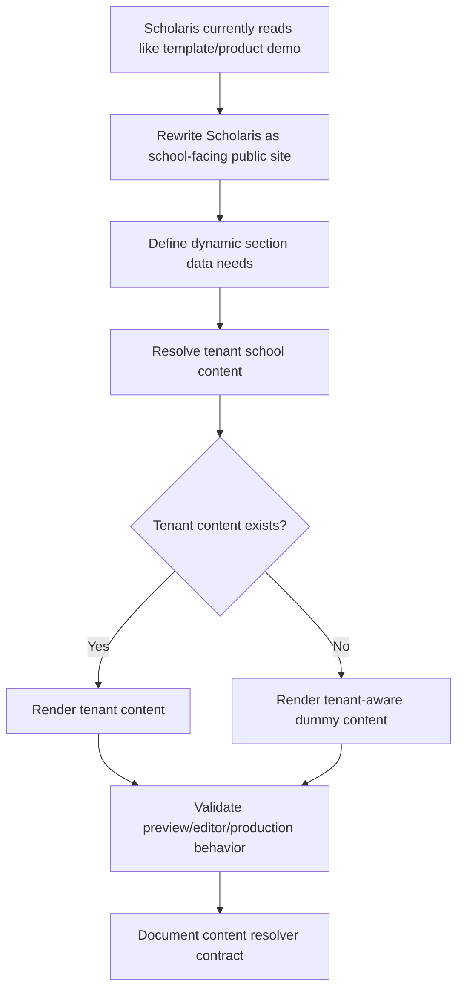

# Plan: School-Facing Scholaris Redesign And Dummy Data Support

## Type
Feature

## Status
Done

## Created Date
2026-06-19

## Last Updated
2026-06-19

## Goal Or Problem
Scholaris must feel like a real public website for the tenant school itself, not like a SaaS template demo. The template should present school identity, admissions, academics, campus life, leadership, announcements, events, blog posts, and parent-facing calls to action. Dynamic sections must load real school content when available and fall back to realistic dummy content only when tenant content is missing.

## Current Context
- `packages/template-registry/src/templates/k12-plus-template-1.tsx` defines Scholaris.
- Scholaris currently includes fallback copy such as "Build a public school website..." and "starter template registry scaffold", which describes the website product rather than the school.
- `packages/template-registry/src/content-data.ts` already provides `createMockWebsiteContentData(tenant)` and `createWebsiteContentDataFromConfig(tenant, config)`.
- Current config-backed dynamic support is strongest for `cms.announcements` and `cms.blogPosts`; `events` and `resources` still fall back to mock data and need a clearer live-content contract.
- `apps/school-site/src/lib/tenant/resolve-public-tenant.ts` loads the tenant school and published website config, or falls back to mock tenant/config when a tenant or published config is missing.
- `apps/school-site/src/lib/website/get-public-website-data.ts` currently delegates to `createWebsiteContentDataFromConfig`.
- Brain docs define the public website platform as tenant-resolved and production-safe, with templates as presentation layers over shared shadcn-based primitives.

## Proposed Approach
Redesign Scholaris around a school-facing content model. Replace product-demo language with tenant-school language and restructure visible sections around families deciding whether to trust and enroll in the school.

Define a stronger content resolution contract for registry templates:
- First load tenant-owned school content from published website config and available school content sources.
- Then merge in dynamic resources such as announcements, blog posts, events, resources, staff highlights, stats, and gallery media when present.
- Finally use tenant-aware dummy content for any missing dynamic surface, with copy that still reads like a real school site.

Keep dummy data support explicit in the registry so editor, preview, dummy, and production modes behave predictably. Dummy content should be obviously safe and realistic, but should not leak into live production when corresponding tenant content exists.

## Visual Plan

## Implementation Steps
- Audit Scholaris copy, sections, CTA labels, editable field descriptions, AI descriptions, and fallback content for product-demo language.
- Redesign the Scholaris homepage around school-facing sections: hero, announcement strip, admissions path, academics, campus life, leadership, stats, upcoming events, blog/news, testimonials, gallery, and contact/enquiry CTA.
- Redesign supporting pages so About, Blog list, Blog detail, and any future enrollment-facing routes read as public school surfaces.
- Expand or normalize `WebsiteTemplateContentData` so announcements, blog posts, events, resources, staff highlights, stats, and media-like collections can be resolved consistently.
- Update `createWebsiteContentDataFromConfig` to merge live tenant content first and tenant-aware dummy content second for every dynamic collection.
- Ensure `apps/school-site` production rendering uses published tenant config and available school content before fallback data.
- Ensure editor/preview/dummy mode can show realistic data even when the tenant has not configured CMS blocks yet.
- Update editable field metadata and `aiDescription` text so AI generation prompts produce school-facing copy.
- Add focused tests or fixtures for content resolution: full tenant data, partial tenant data, no tenant data, and no published config.

## Affected Files Or Areas
- `packages/template-registry/src/templates/k12-plus-template-1.tsx`
- `packages/template-registry/src/templates/k12-plus-template-1-client.tsx`
- `packages/template-registry/src/content-data.ts`
- `packages/template-registry/src/types.ts`
- `packages/template-registry/src/mock.ts`
- `packages/template-registry/src/adapters.ts`
- `apps/school-site/src/lib/website/get-public-website-data.ts`
- `apps/school-site/src/lib/website/render-public-page.tsx`
- `apps/school-site/src/lib/tenant/resolve-public-tenant.ts`
- `apps/dashboard/src/app/[domain]/(sidebar)/settings/website/[configId]/cms/`
- `packages/db/src/website.ts`
- `brain/features/school-website-template-registry.md`

## Acceptance Criteria
- Scholaris no longer contains public-facing copy that markets the template registry, website builder, or SchoolClerk itself.
- Scholaris reads as the tenant school's own public site across home, about, blog list, and blog detail pages.
- Dynamic sections render tenant content when present.
- Dynamic sections fall back to tenant-aware dummy content when tenant content is missing.
- Preview/editor/dummy mode works without a published config and still shows realistic school content.
- Production mode renders published tenant content first and only uses fallback content for missing optional dynamic surfaces.
- AI generation metadata for Scholaris fields produces school-facing copy.

## Test Plan
- Add or update focused content resolver tests for full, partial, and empty CMS/config content.
- Manually preview Scholaris in the dashboard website builder with no CMS blocks and confirm dummy content appears.
- Add sample CMS announcements/blog posts, save the draft, and confirm those replace dummy content in preview.
- Manually render the school-site local URL for a tenant with a published Scholaris config and confirm school content appears before fallback content.
- Run the narrowest relevant typecheck or package test for `packages/template-registry` if available.

## Risks / Edge Cases
- Partial tenant content may create uneven sections if dummy and real items are mixed without clear ordering.
- Existing saved Scholaris configs may still contain old product-demo copy until upgraded or manually edited.
- Fallback data must not hide missing required production content where the UI should instead encourage setup.
- Dynamic data contracts may expand before database-backed CMS models exist, so config-backed content must remain compatible with future persistence.
- Dummy data should be tenant-aware enough to look realistic without pretending to be verified real school facts.

## Open Questions
- TODO: Should existing saved Scholaris configurations be auto-upgraded away from old product-demo defaults, or should only new configs receive redesigned defaults?
- TODO: Which school-owned database sources should feed events, staff highlights, stats, and resources before a dedicated CMS model exists?
- TODO: Should production mode visibly omit optional dynamic sections with no tenant content, or keep dummy fallback for all optional sections until the tenant edits them?

## Implementation Notes
- Scholaris public-facing fallback copy now reads as the tenant school's own website rather than a template/product demo.
- Empty Scholaris homepage feature, stat, staff, announcement, hero testimonial, and gallery areas now have school-ready starter content.
- `createWebsiteContentDataFromConfig` now resolves `cms.events` and `cms.resources` in addition to `cms.announcements` and `cms.blogPosts`, with tenant-aware school dummy fallbacks when missing.
- Website CMS management now supports announcement, blog, event, and resource collections.
- Verification completed with scoped text scans and `git diff --check`; full typecheck and browser QA were not run.

## Linked Task
- Task Title: School-Facing Scholaris Redesign And Dummy Data Support
- Task File: brain/tasks/done.md
