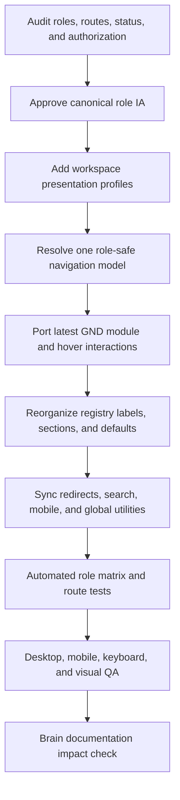

# Plan: Role-Based Sidebar IA And Latest GND Navigation Refresh

## Type
Feature

## Status
In Progress

## Created Date
2026-08-01

## Last Updated
2026-08-01

## Implementation Update

Code implementation and non-browser verification completed on 2026-08-01. The plan remains In Progress because authenticated browser/UI, keyboard, screen-reader, and visual QA were explicitly deferred to a separate phase.

## Goal Or Problem
Reorganize SchoolClerk's sidebar into a predictable role-aware information architecture and adapt the latest useful GND sidenav interactions without copying GND's routes, permissions, or business domains.

## Current Context
- `apps/dashboard/src/features/navigation/dashboard-nav-registry.ts` is the current typed source of navigation definitions.
- `packages/navigation` adapts the registry into the `packages/site-nav` rendering model. ADR-0004 requires preserving this registry-owned architecture.
- The June 2026 GND-style visual refresh is complete, but GND has since added module selection, selected-module-only rendering, coordinated hover surfaces, safer account/dropdown behavior, improved child-link interaction, and a stronger mobile sheet.
- Current role coverage is uneven: Admin has 33 live links, Teacher 6, Accountant 12, Registrar 2, HR 4, Staff 2, Support 1, Parent 1, and Student 0.
- `packages/site-nav/src/lib/links.ts` hides the sidebar when fewer than five links are available, so several valid low-link roles lose navigation accidentally.
- `packages/site-nav/src/components/navs-list.tsx` contains a Teacher-only flattening branch, which makes the renderer responsible for role-specific IA.
- Navigation statuses have drifted from route maturity. For example, `/academic/reports` is implemented but marked upcoming, `/teacher/reports` is implemented but absent from the registry, and `/staff/payroll` needs maturity verification before remaining live.
- Navigation visibility is role-based today. `institutionTypes` and `requiresModules` exist in types but are not enforced by the adapter, and navigation hiding must not be treated as route/API authorization.
- `apps/dashboard/src/sidebar/utils.ts` appears to be a legacy duplicate definition and should be retired only after a usage/parity check.

## Proposed Approach
Keep one canonical feature registry and add lightweight workspace presentation profiles. Feature destinations remain defined once; profiles determine the permitted workspace, module order, default destination, and explicit navigation surface for each role. The site-nav renderer receives a resolved navigation model and has no role-specific branches.

Use this hierarchy:

`workspace -> module -> section -> destination -> optional child destination`

Use explicit navigation surfaces instead of link-count inference:
- `sidebar`: render the full rail; show the module selector only when two or more modules are available.
- `compact`: render one static module and its links without a selector.
- `header-only`: render global utilities/account chrome without an empty sidebar.
- `unavailable`: use a safe intentional landing state; do not fall through to an unauthorized default route.

Keep notifications/search, term or session context, profile, and sign-out in global chrome rather than duplicating them as ordinary module links. In production, render only `live` destinations; expose `beta` only through an explicit rollout flag and keep `upcoming`/`hidden` destinations out of production navigation.

### Designs Considered

1. Separate link arrays for every role: easiest to read locally, but duplicates shared destinations and will drift across nine roles. Rejected.
2. One large role-filtered tree with renderer special cases: closest to the current implementation, but it keeps role knowledge in UI code and scales poorly. Rejected.
3. One destination registry plus workspace presentation profiles: preserves ADR-0004, keeps links canonical, supports deterministic role ordering/defaults, and keeps rendering generic. Recommended.

The broader alternative of introducing tenant membership, capability, entitlement, route-catalog, and multi-role workspace platforms at once is deliberately deferred. The proposed profiles leave room for those concerns without making them prerequisites for this sidebar reorganization.

### Target Role Information Architecture

#### Admin — `sidebar`
1. Overview
   - Dashboard
2. People
   - Student Records: Students, Enrollment
   - Staff: Teachers, Non-Teaching Staff, Departments
   - Workforce: Staff Attendance, Payroll only after maturity verification
3. Academics
   - Overview
   - Curriculum: Classes, Subjects
   - Assessment & Results: Assessment Recording, Class Report Sheets, Student Reports
   - Future and hidden until live: Tests & Exams, Grading
4. Finance
   - Overview
   - Collections: Receive Payment, Student Balances, Collections
   - Payables: All Payables, Payroll Bills, Service Bills, Owing & Repayments
   - Accounting: Accounts, Transfers, Ledger, Reconciliation
   - Setup: Fee Structures, Service Billables
5. Operations
   - Inventory, only when tenant module filtering is actually enforced
6. Settings
   - School Profile
   - Document Templates
   - Website, with Website Media nested beneath it
   - Future and hidden until live: Academic Session, Roles & Permissions

#### Teacher — `compact`
- Overview
- Classroom Work: My Classes, My Students, Attendance
- Assessment & Results: Score Entry (`/assessment-recording`), Reports (`/teacher/reports`)
- Future and hidden until live: Assessments, Grading, Timetable, Announcements, Calendar

Remove the Teacher-only flattening branch. The profile and registry order must produce this layout through the same renderer used by every other role.

#### Accountant — `sidebar`
1. Finance
   - Collections: Receive Payment, Student Balances, Collections
   - Payables: All Payables, Payroll Bills, Service Bills, Owing & Repayments
   - Accounting: Transfers, Ledger, Reconciliation
2. Operations
   - Inventory, subject to tenant-module and permission verification

Keep Finance Overview, Accounts, Fee Structures, and Service Billables Admin-only unless a separate authorization decision approves Accountant access. Default to Receive Payment or Collections until a role-safe overview is approved.

#### Registrar — `compact`
- Admissions: Enrollment
- Records: Student Directory after route-level authorization is confirmed

Use Enrollment as the initial default because it is the currently proven Registrar workflow. The student API documents Registrar management access, but the page/navigation authorization contract must be verified before the Directory link is promoted.

#### HR — `compact`
- People: Non-Teaching Staff
- Organization: Departments
- Workforce: Staff Attendance

Keep Teachers and Payroll excluded until route/API authorization and product ownership explicitly approve them.

#### Staff — `compact` or `header-only` after landing audit
- Dashboard
- Future and hidden until live: Calendar

Treat generic Staff as view-only by default. Audit the current `/` behavior because Teacher and Staff routing can disagree with the Teacher-only route-group guard.

#### Parent — `compact`
- Overview
- Future and hidden until live: Student Performance, Payments, Communication

The single live Overview link must not disappear because of a numeric link threshold.

#### Support — `header-only`
- Notifications through global chrome
- Profile/account controls

Do not infer tenant operations access or fabricate a Support module. A dedicated Support workspace requires a separate product and permission plan.

#### Student — `unavailable`
No dedicated Student workspace or proven student-scoped authorization exists. Reserve the future IA without registering production links:
- Overview
- Learning: Classes, Timetable, Assignments
- Progress: Attendance, Results
- Finance: Fees & Payments
- School: Announcements

Do not reuse administrative report or teacher routes for Student users. Provide a safe unavailable state or prevent role provisioning until a dedicated portal is implemented.

### Latest GND Features To Adapt
- `ModuleSelector`, `ModuleMenuItems`, and selected-module-only rendering.
- Route-aware selected-module state with deterministic fallback to the first permitted module.
- A coordinated hover controller across the sidebar, module dropdown, and account dropdown.
- Existing 84px collapsed and 268px expanded dimensions, with the shell/header offset kept aligned.
- Refined active cards, section labels, spacing, and icon treatment using SchoolClerk tokens.
- Explicit nested-link expansion, delayed hover preview, and scroll compensation when child groups collapse.
- Mobile sheet header, close control, module selector, 44px touch targets, safe-area padding, and close-on-navigation.
- Stable derived navigation while auth/role data transitions.
- Unit tests for module selection, visible modules, active route matching, and duplicate href handling.

Do not copy GND domain routes, permissions, access-open mode, default-tab rewriting, or domain-specific icons. Add keyboard/focus parity and reduced-motion behavior rather than copying mouse-only interactions.

## Visual Plan

## Implementation Steps
1. Audit and freeze the navigation contract.
   - Enumerate all nine typed roles and normalize role spelling/casing at the boundary.
   - Verify every current registry destination against route existence, page maturity, server authorization, and product ownership.
   - Correct stale status classifications before rearranging links.
   - Decide Registrar Directory access, generic Staff landing behavior, Inventory ownership, and the Student/Support safe landing policy.
   - Record exact expected modules, sections, links, and default hrefs as a test fixture before changing UI behavior.
2. Add workspace presentation profiles in `packages/navigation` or the dashboard navigation feature.
   - Define role/workspace profile keys, module order, section/item overrides only where necessary, default destination, and explicit surface mode.
   - Keep feature availability on registry definitions and keep profile logic presentation-focused.
   - Intersect inherited availability constraints rather than replacing parent constraints with child constraints.
   - Resolve `roles`, permissions, status, institution type, and enabled modules in one pure derivation step.
3. Reorganize the canonical registry.
   - Implement the target role IA without changing canonical URLs.
   - Combine Admin Students and Staff into the People module with clear sections.
   - Split Teacher Score Entry from Reports and link the latter to `/teacher/reports`.
   - Nest Website Media beneath Website.
   - Remove ordinary Notifications duplication in favor of global chrome.
   - Keep detail pages, redirects, and contextual workflows out of the primary sidebar.
   - Verify and retire the unused legacy `apps/dashboard/src/sidebar/utils.ts` definition after parity checks.
4. Adapt the latest GND interaction foundation in `packages/site-nav`.
   - Add module selection helpers and components.
   - Centralize expand/collapse and floating-surface hover state in the site-nav context.
   - Render only the selected named module plus explicit global utilities.
   - Remove the Teacher-only branch and the `totalLinks < 5` suppression heuristic.
   - Update nested item, user menu, and mobile sheet behavior with keyboard/touch parity.
5. Synchronize navigation consumers.
   - Keep login/default redirects aligned with the first permitted live destination.
   - Ensure Find Anything/search uses the same resolved registry and never exposes forbidden or upcoming destinations.
   - Keep app-relative tenant URLs, active-route matching, header offsets, mobile navigation, and term/session context aligned.
   - Do not broaden route/API access merely because a destination becomes visible.
6. Add focused automated validation.
   - Table-driven role matrix tests for Admin, Teacher, Accountant, Registrar, HR, Staff, Parent, Support, and Student.
   - Route existence and canonical href tests for all live destinations.
   - Tests for production status filtering, default hrefs, nested route specificity, duplicate href safety, tenant module filtering, and zero/one/many-module surface modes.
   - Port/adapt GND module selection tests into SchoolClerk namespaces.
7. Run static and interactive QA.
   - `bun --filter @school-clerk/navigation typecheck`
   - `bun --filter @school-clerk/site-nav typecheck`
   - `bun --filter @school-clerk/dashboard typecheck`
   - Narrow Bun tests for navigation packages/features.
   - Authenticated desktop checks: collapsed, expanded, module selection, active state, nested links, dropdown hover transfer, account menu, scroll stability, and shell alignment.
   - Authenticated mobile checks: open/close, module selection, focus trapping, close-on-link, safe areas, and touch targets.
   - Keyboard/screen-reader and reduced-motion checks.
8. Complete the Brain impact check after implementation.
   - Create or update `.brain/features/dashboard-navigation.md` with the final role matrix and behavior.
   - Update `.brain/api/permissions.md` only for verified authorization changes.
   - Update ADR-0004 only if navigation ownership or registry architecture changes materially; the recommended approach is intended to remain within it.
   - Move the companion task through backlog, in-progress, and done only as implementation and review status change.

## Affected Files Or Areas
- `apps/dashboard/src/features/navigation/dashboard-nav-registry.ts`
- `apps/dashboard/src/features/navigation/dashboard-nav-modules/`
- `apps/dashboard/src/features/navigation/sidebar-modules.ts`
- `apps/dashboard/src/features/navigation/` new profile/tests as needed
- `apps/dashboard/src/components/nav-layout-client.tsx`
- `apps/dashboard/src/components/sidebar/links.ts`
- `apps/dashboard/src/sidebar/utils.ts`
- `packages/navigation/src/types.ts`
- `packages/navigation/src/sidebar.ts`
- `packages/site-nav/src/components/use-site-nav.tsx`
- `packages/site-nav/src/components/sidebar.tsx`
- `packages/site-nav/src/components/navs-list.tsx`
- `packages/site-nav/src/components/nav-item.tsx`
- `packages/site-nav/src/components/nav-child-item.tsx`
- `packages/site-nav/src/components/mobile-sidebar.tsx`
- `packages/site-nav/src/components/user.tsx`
- `packages/site-nav/src/components/module-selector.tsx` or equivalent
- `packages/site-nav/src/components/module-menu-items.tsx` or equivalent
- `packages/site-nav/src/lib/module-selection.ts` or equivalent
- `packages/site-nav/src/lib/links.ts`
- `packages/site-nav/src/index.tsx`
- `.brain/features/dashboard-navigation.md`
- `.brain/api/permissions.md` only if authorization changes
- `.brain/decisions/ADR-0004-navigation-registry-and-workspace-owned-sidebar-architecture.md` only if the architecture decision changes

## Acceptance Criteria
- One canonical registry remains the source of navigation truth; no per-role duplicate link trees are introduced.
- All nine roles resolve to an explicit workspace/default/surface policy.
- No UI component contains a Teacher-only or other role-specific rendering branch.
- Low-link roles no longer lose navigation because of a numeric threshold.
- Student and Support never fall through to unauthorized Admin/Teacher routes.
- Every visible production link is live, tenant-relative, route-backed, and server-authorized for the role.
- Upcoming/hidden links never render in production and do not leak into search/default redirects.
- Multi-module roles use the GND-style selector; single-module roles use a static identity without unnecessary selector chrome.
- Active module/link/child matching remains correct for deep routes.
- Desktop rail, floating menus, account menu, content offset, mobile sheet, and reduced-motion/keyboard interactions meet the QA matrix.
- No unrelated route URLs, API contracts, database schema, or product permissions change.

## Test Plan
- Run the three focused typechecks and navigation tests listed in Implementation Step 7.
- Compare exact resolved role snapshots against the approved role matrix in production-status mode.
- Verify forbidden deep-link behavior separately from sidebar hiding.
- Verify an Admin, Teacher, Accountant, Registrar, HR, Staff, Parent, Support, and Student account or deterministic fixture.
- Verify desktop light/dark themes at collapsed and expanded widths.
- Verify mobile sheet behavior at narrow viewport and with long translated labels.
- Record intentional differences from the latest GND reference.

## Risks / Edge Cases
- Navigation visibility may disagree with server authorization. Mitigation: perform the authorization audit first and test forbidden deep links independently.
- Registry statuses are stale in both directions. Mitigation: route/maturity audit before rearrangement.
- Generic Staff can encounter a routing mismatch with the Teacher guard. Mitigation: audit and fix the default landing contract before rollout.
- Student and Support lack complete workspaces. Mitigation: use explicit unavailable/header-only profiles and do not invent permissions.
- Combining Students and Staff into People may feel broad. Mitigation: retain distinct Student Records, Staff, and Workforce sections; split later without route changes if usability testing disagrees.
- GND floating-menu behavior can regress hover, focus, or scroll. Mitigation: port the state model with unit tests and add keyboard/mobile parity.
- Tenant module and institution filters exist only in types today. Mitigation: do not claim conditional visibility until resolver wiring and tests exist.
- Existing dirty worktree changes may overlap Brain or navigation files during implementation. Mitigation: preserve unrelated changes and re-check status before edits.

## Open Questions
- Resolved: Registrar receives Student Directory because the existing student API contract already grants Registrar management access; Enrollment remains the default.
- Resolved: Accountant retains Inventory and does not receive the Admin-only Finance Overview.
- Resolved: Staff receives a view-only root dashboard; Support uses header-only Notifications and account chrome.
- Resolved: Parent keeps a compact one-link portal so its valid destination is not hidden by link-count inference.
- Resolved: Student uses an explicit unavailable landing until a dedicated student-scoped portal and authorization model exist.

## Linked Task
- Task Title: Role-Based Sidebar IA And Latest GND Navigation Refresh
- Task File: .brain/tasks/roadmap.md
